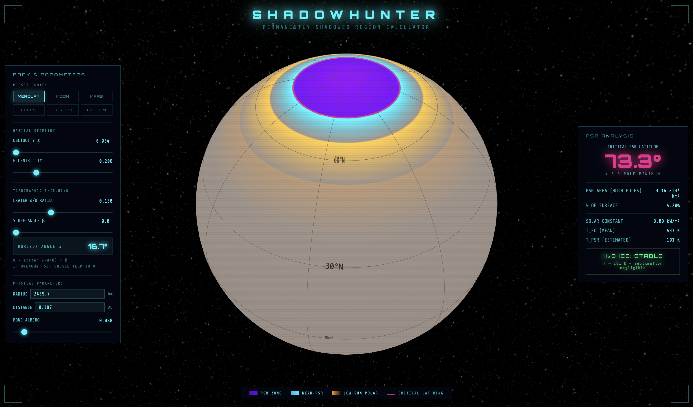

# SHADOWHUNTER
### a Permanently Shadowed Region Calculator
*by Liliane ML Burkhard, 2026*

---

## Overview

**Shadowhunter** is an interactive browser-based tool for computing and visualizing Permanently Shadowed Regions (PSRs) on planetary bodies. Given a set of orbital and physical parameters, the tool calculates the critical latitude above which crater floors or sloped terrain can remain in permanent shadow throughout a full orbital period and estimates whether those regions are cold enough to trap and preserve water ice.

The tool runs entirely in the browser, requires no installation and updates in real time as parameters are adjusted. It includes presets for Mercury, the Moon, Mars, Ceres and Europa, and supports fully custom planetary configurations.

Go to website: [SHADOWHUNTER](https://liliane-sys.github.io/shadowhunter/)
---

## Preview



---


## The Physics

### What is a Permanently Shadowed Region?

A Permanently Shadowed Region is a surface location that never receives direct sunlight over a complete orbital period. On airless or thin-atmosphere bodies, these regions can remain extraordinarily cold; cold enough to act as cold traps for volatiles such as water ice, CO₂, SO₂ and other compounds that would otherwise sublimate.

PSRs are not simply 'dark craters': Their existence depends on a precise geometric relationship between the body's axial tilt, the local topography and orbital geometry.

### The Horizon Angle

The fundamental quantity governing PSR formation is the **topographic horizon angle** α : the angular height of any obstruction (a crater rim, a valley wall, or a sloped surface) as seen from the shadowed location, measured from the local horizontal in the direction of the Sun.

Shadowhunter computes α from two independent contributions that add linearly:

```
α = arctan(2 × d/D) + β
```

where:
- **d/D** is the crater depth-to-diameter ratio (dimensionless). For a simple bowl-shaped crater, the rim subtends an angle of arctan(2d/D) as seen from the crater floor center.
- **β** is an additional pole-facing slope angle (degrees). This accounts for terrain that is tilted away from the Sun; a hillside, a valley wall, or a regional topographic trend.

If only one term is known, the other is set to zero. If neither is known, a representative value of d/D = 0.15 (typical of fresh mid-latitude craters) is a reasonable default.

### The Critical PSR Latitude

A surface element at latitude φ, with horizon angle α, is permanently shadowed if the maximum solar elevation it ever experiences over a full orbit is less than α. The maximum solar elevation at latitude φ on a body with axial tilt ε occurs at summer solstice:

```
el_max(φ) = 90° − |φ| + ε
```

Permanent shadow, however, is broken by direct sunlight from *any* part of the solar disk, so the relevant quantity is the elevation of the **upper limb** of the Sun. The disk has an apparent angular radius θ☉ = arcsin(R☉/r), which is largest at perihelion:

```
θ☉ = arcsin( R☉ / [a(1 − e)] )
```

where R☉ = 0.00465 AU is the solar radius, a the semi-major axis and e the orbital eccentricity. Setting el_max + θ☉ = α and solving for φ gives the **critical PSR latitude**:

```
φ_PSR = 90° + ε + θ☉ − α
````

All surface locations with |φ| ≥ φ_PSR can host PSRs if they have the appropriate topography. Locations below this latitude receive direct sunlight at some point in the orbit to prevent permanent shadowing; however, extreme local topography could still create shadows at lower latitudes.

Note that φ_PSR is a *necessary* condition: It defines where PSRs are geometrically *possible*, not where they universally exist. Actual PSR coverage depends on the detailed topography at each location.

### Orbital Eccentricity Effects

Eccentricity enters the model through two physically distinct channels:

**1. Geometric (via the solar disk size).** The angular radius of the Sun scales inversely with heliocentric distance, so at perihelion — r = a(1 − e) — the disk appears largest and its upper limb reaches highest above the geometric solar elevation. This raises φ_PSR by θ☉ and shrinks the PSR-capable zone. The effect is far from negligible for eccentric orbits close to the Sun: for Mercury (e = 0.206, a = 0.387 AU), θ☉ ≈ 0.87° at perihelion; roughly **25 times larger than Mercury's obliquity** (0.034°), making the finite solar disk, not the axial tilt, the dominant term limiting Mercury's PSR extent in this model. For the Moon θ☉ ≈ 0.28°, comparable to lunar obliquity effects at the ~20% level.

Because permanence must hold over *all* epochs, θ☉ is evaluated at perihelion, i.e. the model assumes polar summer solstice can coincide with perihelion. For most bodies the argument of perihelion precesses over 10⁴–10⁵ year timescales, so this alignment recurs and the worst-case choice is the correct conservative one for permanent shadow. For a fixed present-day orbital configuration it may slightly overstate the effect.

**2. Thermal (via orbit-averaged insolation).** The time average of the inverse-square insolation over one Keplerian orbit is

```
⟨1/r²⟩ = 1 / (a² √(1 − e²))
```

(a consequence of conservation of angular momentum), so the equilibrium temperature scales by (1 − e²)^(−1/8) relative to the circular-orbit value. This is a small correction (+0.5% for Mercury, <0.1% for the other presets) but is now included for consistency. The tool additionally reports the instantaneous solar flux at perihelion and aphelion, whose ratio [(1+e)/(1−e)]² reaches ≈2.3 for Mercury.


### PSR-Capable Surface Area

The total surface area capable of hosting PSRs (both polar caps combined) is computed using the spherical cap formula:

```
A_PSR = 4πR² × (1 − sin φ_PSR)
```

where R is the body's radius. This gives the area of both polar caps above the critical latitude as a fraction of total surface area:

```
f_PSR = 1 − sin φ_PSR
```

### Temperature Estimates

**Equilibrium temperature** (mean surface temperature of a rapidly rotating body, using orbit-averaged insolation):

```
T_eq = 278.5 × (1 − A)^0.25 / √a × (1 − e²)^(−1/8)   [K]
```

where A is the Bond albedo, a is the semi-major axis in AU and e is the orbital eccentricity. This is the standard fast-rotator approximation assuming re-radiation over the full sphere; the (1 − e²)^(−1/8) factor accounts for the slightly higher time-averaged insolation on an eccentric orbit (see *Orbital Eccentricity Effects* above).

**PSR temperature** is estimated empirically as:

```
T_PSR ≈ T_eq × 0.25 × (1 − α / 90°)^0.40
```

Deeper topographic shielding (larger α) produces colder PSRs by reducing the indirect thermal flux from surrounding illuminated terrain; the multiplier decreases as α increases, giving the correct physical trend. The coefficient 0.25 is calibrated against known values: Mercury's PSRs (~101 K predicted, 80–100 K observed at 0.387 AU) and the Moon's PSRs (~59 K predicted, 50–100 K observed at 1.0 AU). At α = 0° the formula yields 0.25 × T_eq (indirect heating baseline with no topographic shielding); at α = 90° (complete horizon blockage) T_PSR approaches 0 K as a theoretical limit. The horizon angle is clamped to (0°, 89.9°) before evaluation to ensure mathematically valid real-valued output; values outside this range have no physical meaning for this model.

**Water ice stability** is assessed against the following thresholds:
- **Stable** (T < 110 K): sublimation rate negligible on geological timescales
- **Marginal** (110–180 K): detectable sublimation; ice may be present but unstable over long periods
- **Unstable** (T > 180 K): rapid sublimation; water ice cannot be preserved

### Limitations of the Model

This tool implements a **first-principles geometric model** and is intended for exploration and teaching rather than mission-level analysis. Key simplifications include:

- The equilibrium temperature formula assumes a fast rotator. Slowly rotating bodies (e.g. Mercury with its 3:2 spin-orbit resonance) have a more complex thermal environment.
- The PSR temperature estimate is empirical and does not account for conduction, internal heat sources (relevant for Europa's tidal heating), or regolith thermal inertia.
- The model assumes a spherical body. Real topography creates PSRs at latitudes well below the theoretical critical latitude on bodies with rugged polar terrain.
- Linear slope addition assumes a 2D worst-case geometry. In a true 3D environment, the solar azimuth rotates relative to the slope direction throughout the day.
- Orbital eccentricity enters through the solar disk size at perihelion (geometric, raises φ_PSR) and the orbit-averaged insolation (thermal, scales T_eq). The θ☉ term conservatively assumes polar summer solstice can coincide with perihelion; correct for permanence over precession cycles, but possibly an overestimate for a fixed present-day orbital configuration.
- Kepler timing asymmetries (the body spends more time near aphelion than perihelion) affect the *duration* of illumination episodes but not their existence, and are not modeled. Spin–orbit resonances such as Mercury's longitude-dependent 'hot poles' (3:2 resonance) are likewise not modeled.

---

## Input Parameters

| Parameter | Symbol | Description |
|---|---|---|
| Obliquity | ε | Axial tilt relative to the orbital plane (degrees). The single most important factor controlling PSR extent. |
| Eccentricity | e | Orbital eccentricity. Sets the perihelion distance a(1−e), which controls the solar disk angular radius θ☉ (raising φ_PSR), the orbit-averaged equilibrium temperature and the perihelion/aphelion flux extremes. |
| Crater d/D ratio | d/D | Depth-to-diameter ratio of a representative crater. Typical values: 0.10–0.20 for fresh craters. |
| Slope angle | β | Additional pole-facing terrain slope (degrees). Set to 0 if unknown. |
| Body radius | R | Mean radius of the body in km. Used for PSR area calculation. |
| Distance from star | d | Semi-major axis in AU. Affects solar constant and equilibrium temperature. |
| Bond albedo | A | Fraction of total incident solar radiation reflected by the body. Affects equilibrium temperature. |

---

## Preset Bodies

| Body | ε (°) | d/D | Distance (AU) | Albedo | Notes |
|---|---|---|---|---|---|
| Mercury | 0.034 | 0.15 | 0.387 | 0.088 | PSRs confirmed by MESSENGER; water ice detected |
| Moon | 1.54 | 0.15 | 1.000 | 0.120 | PSRs confirmed by LCROSS, LRO; water ice detected |
| Mars | 25.19 | 0.20 | 1.524 | 0.250 | High obliquity limits PSRs; very deep craters required |
| Ceres | 4.0 | 0.15 | 2.770 | 0.090 | PSRs confirmed by Dawn; water ice detected (2016–17) |
| Europa | 0.1 | 0.08 | 5.204 | 0.670 | Global ice shell present; PSRs relevant for exotic volatile trapping |

---

## Globe Visualization

The globe displays a latitude-dependent color overlay representing the local illumination environment:

| Color | Zone | Meaning |
|---|---|---|
| **Purple** | PSR Zone | \|φ\| ≥ φ_PSR : permanent shadow possible with the specified topography |
| **Cyan-blue** | Near-PSR | Sun grazes the horizon; shallow topography may create local PSRs |
| **Amber** | Low-sun polar | Low solar elevation; significant polar cooling but no permanent shadow |
| **Pink dashed ring** | Critical latitude | φ_PSR : boundary of the PSR-capable zone |

The globe uses an equirectangular canvas texture updated in real time as parameters change. Lighting is uniform (no directional shading) to ensure the body color represents albedo rather than illumination geometry.

---

## Scientific Context

PSRs were first proposed as potential cold traps for lunar volatiles by Kenneth Watson, Bruce Murray, and Harrison Brown in 1961. Their existence on the Moon was confirmed by the LCROSS impact experiment (2009) and subsequently characterized in detail by the Lunar Reconnaissance Orbiter. MESSENGER confirmed water ice in Mercury's PSRs in 2012. The Dawn mission detected water ice in Ceres' permanently shadowed north polar craters in 2016/2017.

Understanding PSR geometry is directly relevant to planetary exploration planning, resource prospecting for future human missions and the broader question of volatile delivery and retention in the inner Solar System.

---

## Data Sources and Acknowledgements

Preset orbital and physical parameters are drawn from published planetary fact sheets (NASA/NSSDCA) and peer-reviewed literature. The tool uses no external data APIs; all computation is performed client-side.

Built with [Globe.gl](https://globe.gl/) (MIT License).

---

## Attribution

If you use Shadowhunter in teaching, outreach or research contexts, please credit:

> Burkhard, L.M.L. (2026). *Shadowhunter: Permanently Shadowed Region Calculator*. Interactive web tool. https://liliane-sys.github.io/shadowhunter

---

*Shadowhunter is part of a suite of interactive planetary science visualization tools including Quakeglobe (live seismic monitoring) and the BELA Altimetry Viewer (BepiColombo laser altimeter data; expected online in 2027).*


